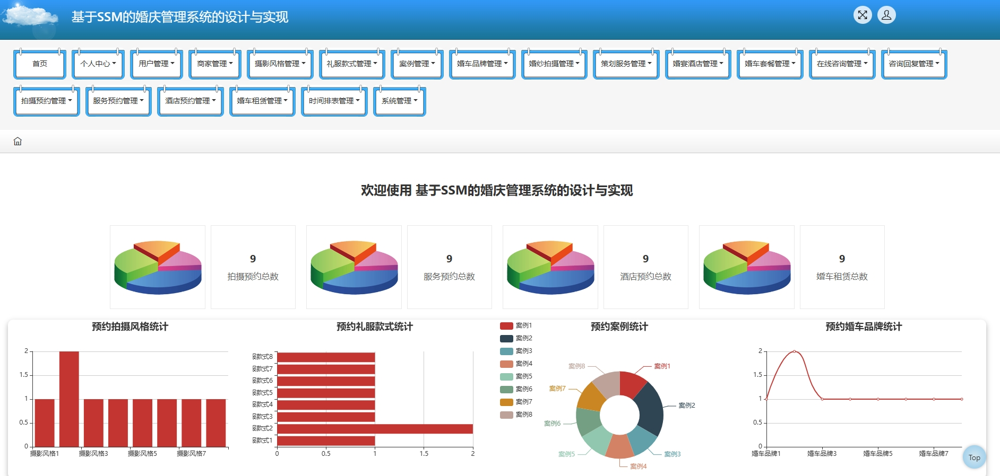
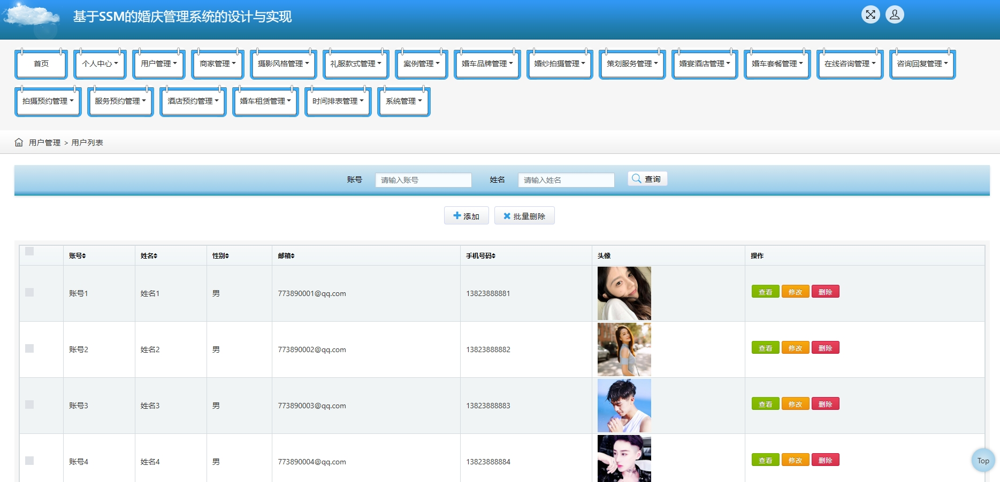
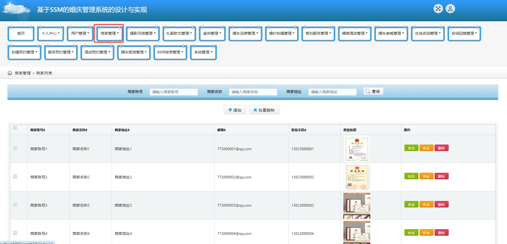
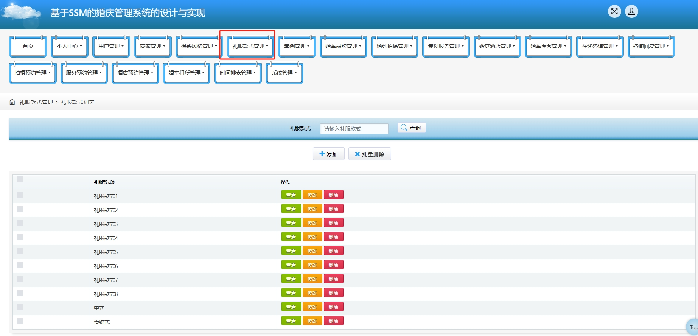
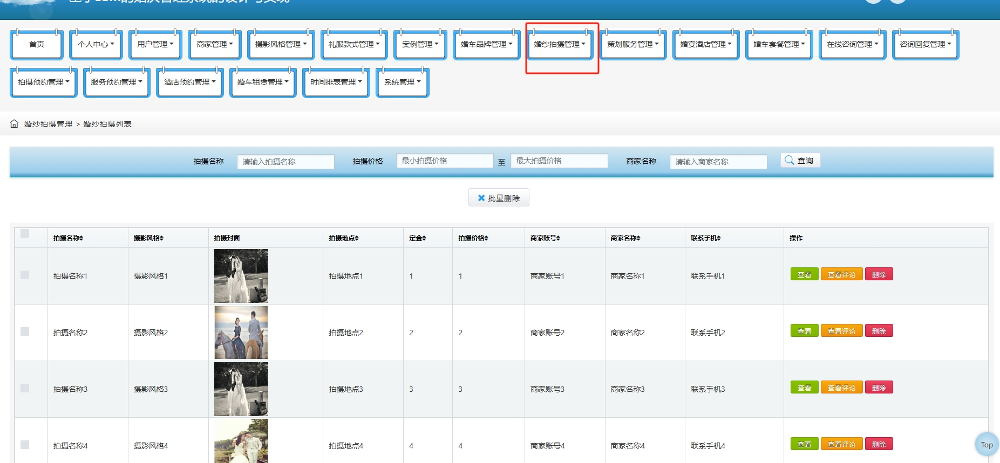
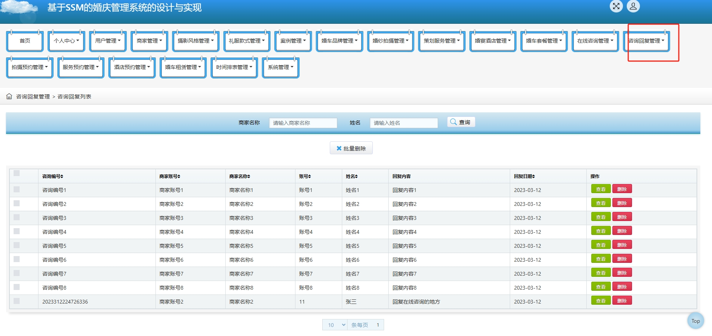
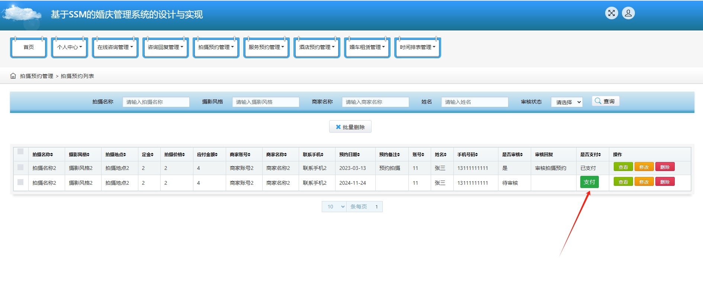
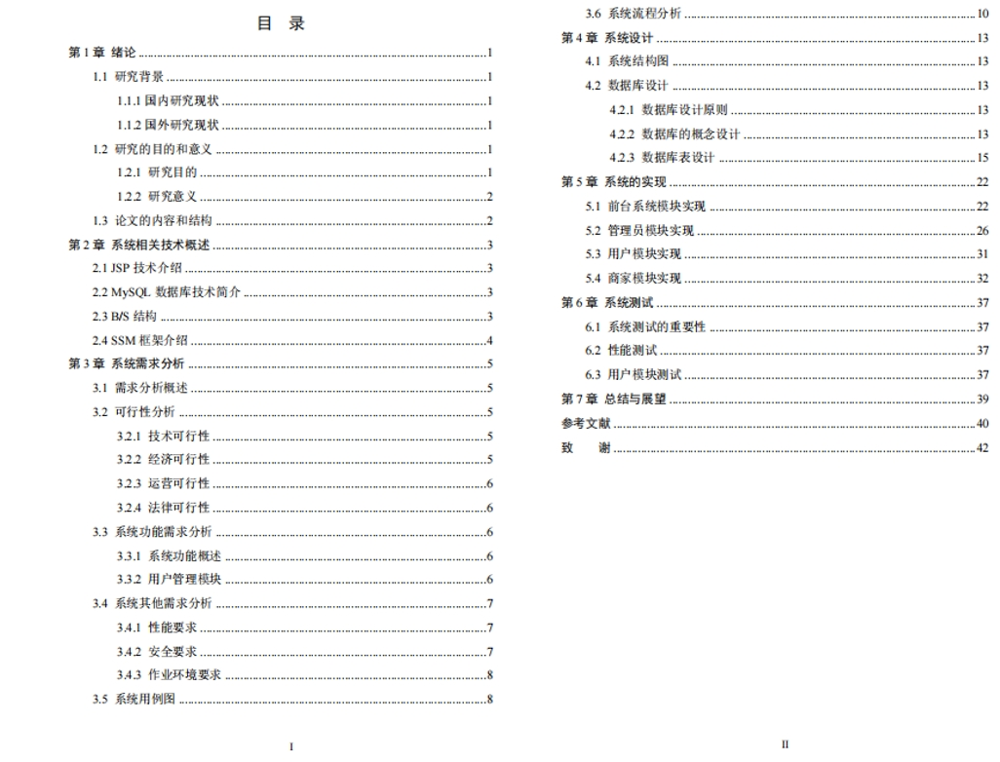

# 1.项目介绍
- 系统角色：管理员、商家（婚庆公司）、用户
- 功能模块：管理员（用户管理、商家管理、摄影风格管理、礼服款式管理、案例管理、婚车品牌管理、婚纱拍摄管理、策划服务管理、婚宴酒店管理、婚车套餐管理、在线咨询管理、商品信息管理、预约管理等）、商家（登录注册、婚纱拍摄、策划服务、婚宴酒店、婚车套餐等）、用户（登录注册、用户中心、预约支付等）
- 技术选型：SSM、jsp、其他课查看pom.xml
- 测试环境：idea2024，mysql5.7，jdk18，maven3，tomcat8等
# 2.项目部署
- 创建数据库，导入sql文件
- 通过idea打开项目，根据本地数据库环境，修改src/main/resources/config.properties  3-5行，如果你本地数据库是8.0的，注意替换pom里依赖的版本、以及第三行配置serverTimezone，这都是基础，百度遍地都是。
- 配置tomcat，启动项目，其中，我将deployment下的application contex配置为 /jspm9t33h
- 后端管理web：http://localhost:8080/jspm9t33h/jsp/login.jsp
- 前端：http://localhost:8080/jspm9t33h/front/index.jsp
- 登录账号密码查看user、yonghu、shangjia三张表
# 3.项目部分截图

# 4.获取方式
[戳我查看](https://gitee.com/aven999/mall)
